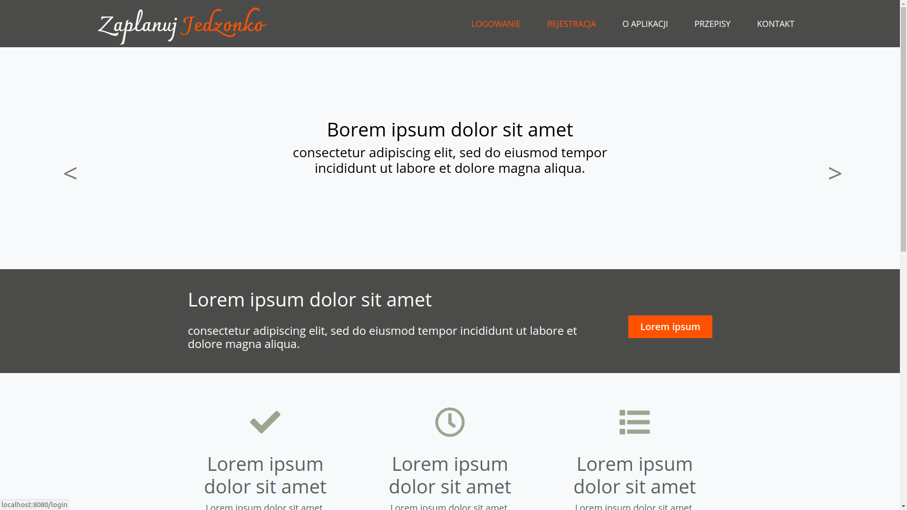
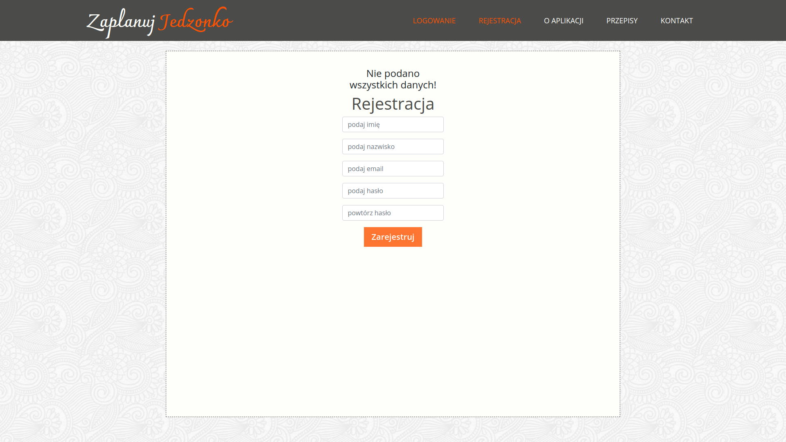
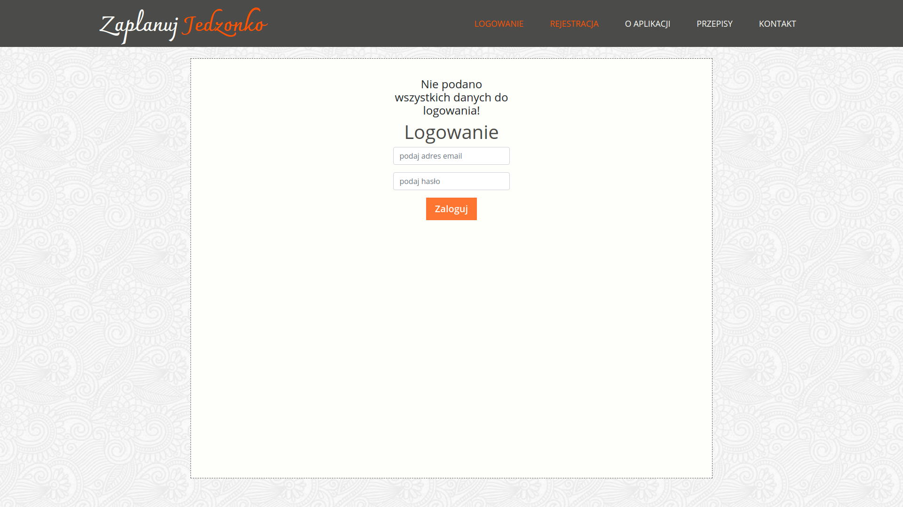

# PlanYourFood

This is a basic web application which was created in Java using Servlet technology during a scrum lab.
This application could be used for promotion purposes by a restaurant or dietary consultant.
In order to enjoy app's entire functionality it is required of a user to register and login.
For the purposes of presentation I have added several views of the application (these are not all app's functionalities.)

#### Landing page

#### Registration

#### Login

