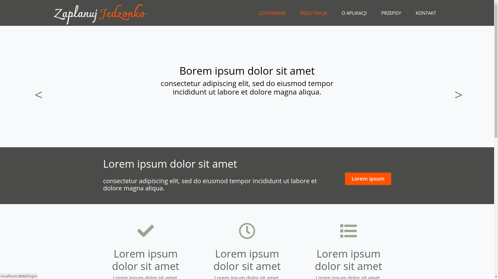
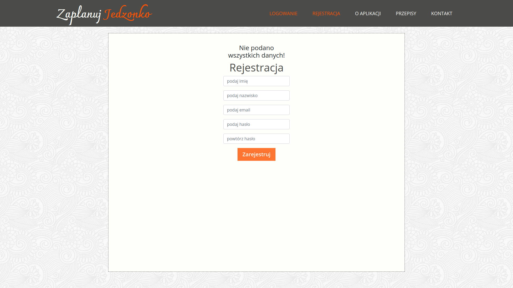
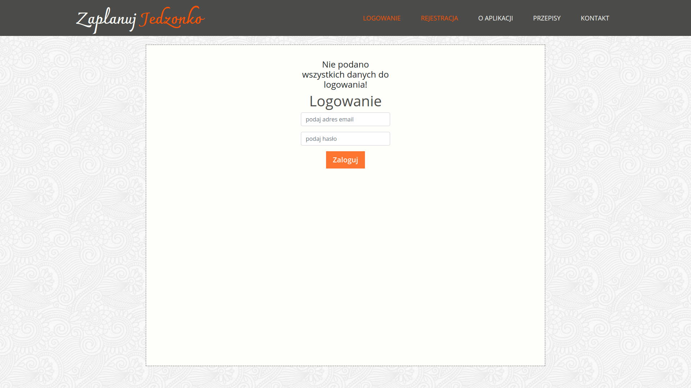
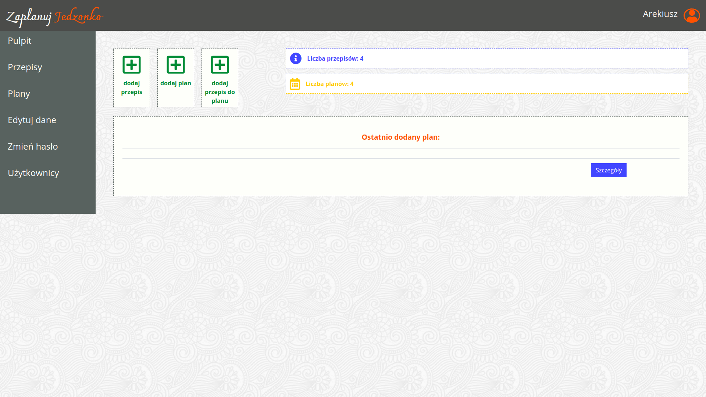
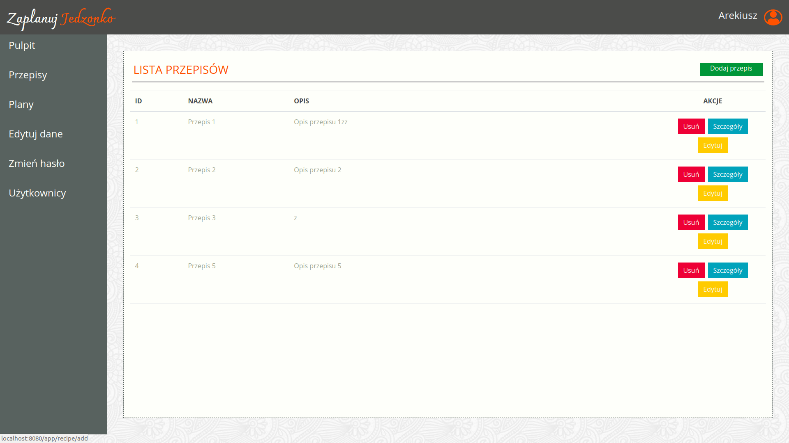
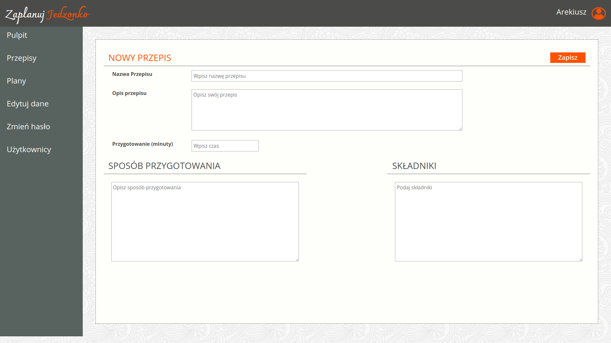

# PlanYourFood

This is a basic web application which was created in Java during scrum lab using Servlet technology, MySQL and Bootstrap.
This application could be used for promotion purposes by a restaurant or dietary consultant.
In order to enjoy app's entire functionality it is required of a user to register and login. 
For the purposes of presentation I have added several views of the application (these are not all app's functionalities!).
Test user login: arkadiusz.jozwiak@coderslab.pl, password: x

#### Landing page

#### Registration

#### Login

#### After logging

#### List of recipes

#### Adding a recipe

